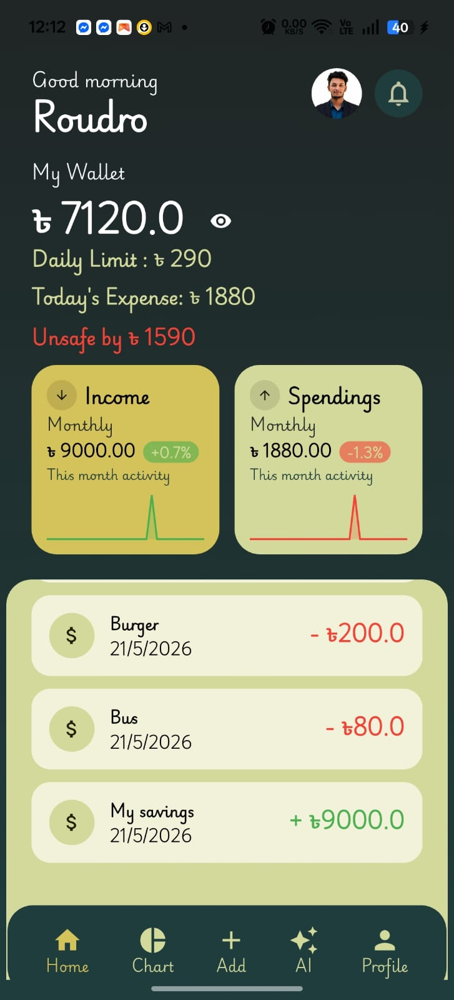
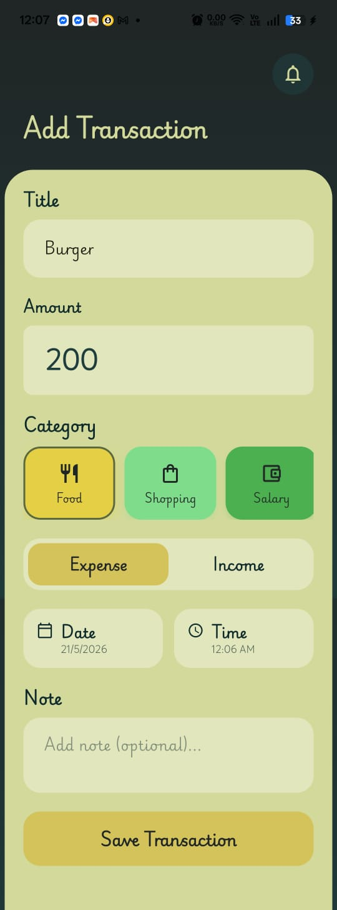
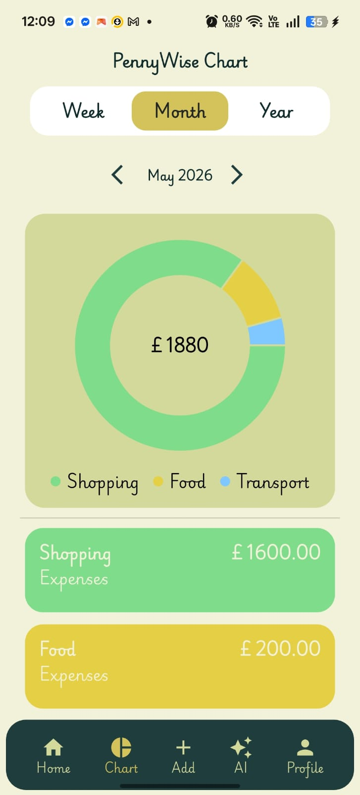
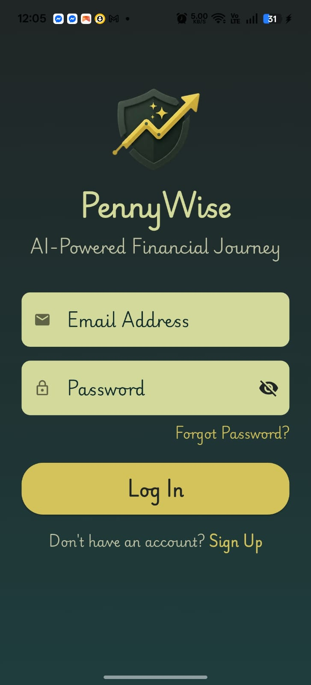
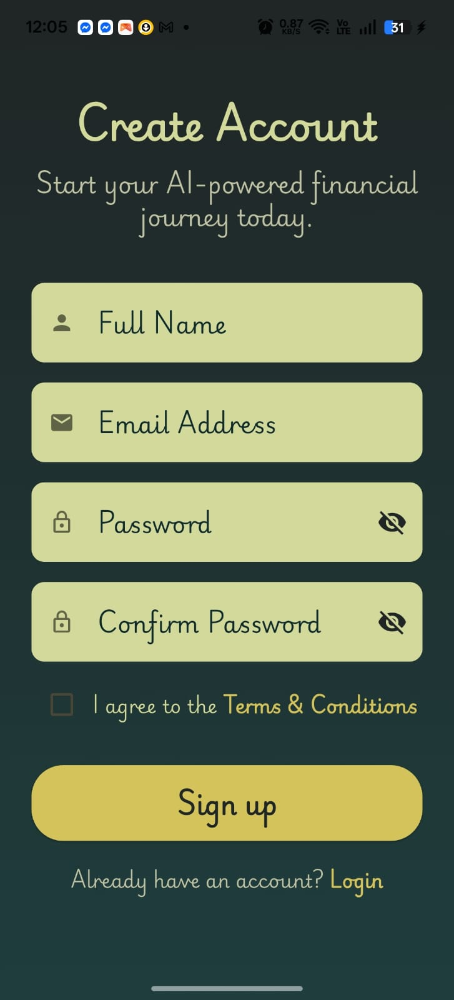

# PennyWise Expense Tracker

PennyWise is an AI-ready offline-first Expense Tracker mobile application built with Flutter.  
The app helps users manage income and expenses efficiently with dynamic analytics, local data persistence, multi-currency support, and scalable architecture.

---

# Features

## Authentication UI
- Login Screen
- Sign Up Screen
- Forgot Password Screen
- Verify Password Screen

## Transaction Management
- Add income and expense transactions
- Delete transactions
- Transaction details page
- Dynamic wallet balance updates
- Category-based transaction management

## Analytics
- Monthly financial analytics
- Dynamic charts and graphs
- Expense visualization system

## Currency System
- Multi-currency support
- Currency search functionality
- Real-time currency update across the app
- Persistent selected currency using Hive

## Personalization
- Hide/Show wallet balance
- Notification toggle system
- Profile settings structure

## Offline-First Architecture
- Fully functional without internet
- Local persistence using Hive
- Guest mode support
- No forced authentication

---

# Tech Stack

## Frontend
- Flutter
- Dart

## State Management
- Provider

## Local Database
- Hive
- hive_flutter

## UI & Visualization
- fl_chart

## Planned Integrations
- Firebase Authentication
- AI-powered financial insights
- Cloud synchronization

---

# Architecture

The application follows a scalable local-first architecture where Hive acts as the primary source of truth for app data.

---

# Current Providers

- TransactionProvider
- CurrencyProvider
- NotificationProvider
- BalanceVisibleProvider
- CategoryProvider

---

# Current Progress

## Completed
- Transaction add/delete system
- Dynamic balance calculation
- Income & expense calculation
- Monthly analytics
- Dynamic graph implementation
- Multi-currency support
- Currency persistence using Hive
- Notification toggle system
- Hide/Show balance system
- Profile settings structure
- Responsive UI design

## Currently Working On
- Scalable Hive architecture
- Transaction persistence using Hive Adapters
- Clean storage management structure

---

# Future Plans

- Firebase Authentication
- AI-powered expense analysis
- Smart budgeting suggestions
- Cloud backup & synchronization
- Dark mode improvements
- Recurring transaction system
- Export financial reports
- Multi-device sync

---

# Project Structure

```text
lib/
│
├── core/
│   ├── constants/
│   ├── theme/
│
├── features/
│   ├── authentication/
│   ├── home/
│   ├── profile/
│   ├── transaction/
│
├── providers/
│
├── widgets/
│
└── main.dart
```

---

# Screenshots

## Home Page


## Add Transaction


## Chart Page


## Transaction Details


## Currency Selection


## Login Screen


## Sign Up Screen


## Forgot Password


## Verify Password


---

# Challenges Faced

- Understanding scalable Provider architecture
- Designing offline-first app structure
- Managing Provider ↔ Hive persistence flow
- Creating reusable state management patterns
- Building dynamic analytics and graph systems

---

# What I Learned

- Flutter state management using Provider
- Local persistence using Hive
- Scalable folder architecture
- Offline-first application design
- Dynamic UI rebuild flow
- Clean architecture principles
- Financial analytics visualization

---

# Author

## Sadman Hossain Roudro

- GitHub: https://github.com/sadmanhossainroudro13
- LinkedIn: https://www.linkedin.com/in/sadman-hossain-roudro-b081703a7/

---

# License

This project is created for learning, portfolio, and architecture practice purposes.